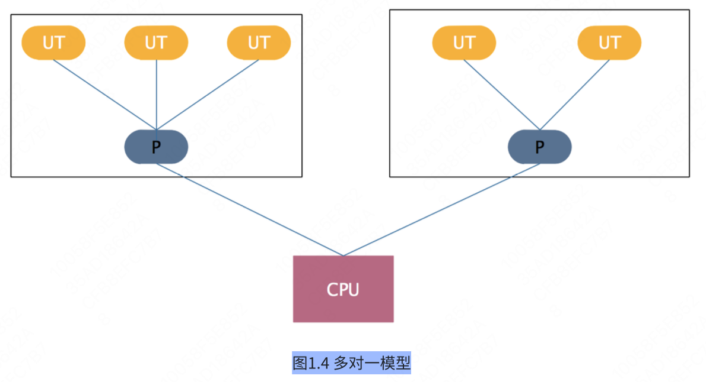

# 0、并发编程的意义

这要从计算机领域存在一条著名的定律——摩尔定律说起，摩尔定律由lntel的创始人之一戈登• 摩尔提出。其内容为：集成电路上可容纳的晶体管数目，约每隔两年便会增加一倍。这句话可以简单地理解为，计算机芯片的运算能力，约每隔两年就能提升一倍。

在二十世纪后半叶，计算机芯片的发展速度印证着这条规律。但是随着晶体管的尺寸越来越接近物理极限，所以自从2013年以来，芯片上集成的晶体管数目的增长速度开始放缓，各大厂商也被开始吐槽“挤牙膏”。

硬件的发展速度逐渐遭遇瓶颈，因此单个芯片上搭载多个CPU成为常态，并且运算能力越强的CPU意味着越昂贵。对于这一现状，各个软件公司的目标是使用更低的成本，开发出运行效率更高的软件。于是产生了“并行/并发编程”的思想，并行的主要目的在于，拆分需要处理的任务，将其发布到多个廉价的CPU上同时进行执行；并发的主要目的在于，由于CPU、寄存器、主存的速度差异，可以为多个任务交替分配CPU时间片，降低CPU闲置等待时间。通过这两种方式，整体上就能低成本地提升程序执行的效率。

但是，并非所有需要被处理任务都是完全独立的，当多个任务在执行期间想要进行读写同一块内存值时，问题出现了：我们应该如何管理共享内存？如何对多个任务进行同步管理，以至于程序不会出错？同时，我们依然需要秉持高效性能的目标，找到最优的解決方法。

这便是并发编程的意义，并发编程已经成为了一种主流的开发模式，这是一名工程师难以回避的进阶内容，也成为了各个公司面试考察的重点环节。

# 1、JVM线程模型

了解了并发编程的意义，那么在计算机上如何实现？ 这个话题很大，本文只介绍在Java开发领域，上层编码到下层运行之间的抽象方式，换言之，也就是JVM线程模型。

## 1.1 线程模型

**什么是线程模型？**

- Java字节码运行在JVM中，JVM运行在各个操作系统上。所以当JVM想要进行线程创建回收这种操作时，势必需要调用操作系统的相关接口，因为线程是属于操作系统的东西啊。也就是说，JVM线程与操作系统线程之间存在着某种映射关系，这两种不同维度的线程之问的规范和协议，就是线程模型。

**可能有读者会存在疑惑：为什么需要这样的中间层？**

- 我们在开发时，直接调用操作系统的接口来创建回收线程不是更直接吗？这个问题的答案显而易见，正如我们现在不常用汇编语言进行开发，而是使用更加简单容易上手的高级语言一样，**这是一种自下而上的抽象**。

- JVM线程对不同操作系统上的原生线程进行了高级抽象，使开发者大多数情况下可以不用关注下层细节，而只要专注上层开发。不过在学习过程中，我们秉持知其然并知其所以然的态度，就需要去理解这种抽象方式，这也有助于将来我们自己进行一些设计的时候，能够复用前人的思想。

理解了什么是线程模型，为什么要有线程模型。接下来介绍一下JVM线程模型的三种类型：一对一，多对一，多对多。

## 1.2 内核线程

**在具体介绍这三种类型之前，有必要先来介绍一下操作系统的内核线程本身是什么样的面貌**。

> 这里我们就以最主流的Linux内核为例。

有一道面试题非常普遍：“说说线程和进程的区别”。网上流传的答案之一是 “线程属于进程”，这个说法是不准确的。Linux线程又被称为 “轻量级进程”，这就使很多同学摸不着头脑，那到底是线程还是进程？我们可以这么去理解，**“线程”是抽象概念（KLT，内核线程）**，因为Linux内部没有专门为线程定义的数据结构和调度算法，所以**Linux去实现 “线程”的方式是 “轻量级进程”（LWP，轻量级进程），本质还是进程**。只不过加了一个“轻量级”的修饰词。

**“轻量级进程”与“进程”的区别在哪？**

- —个Linux进程拥有自己独立的地址空间，而一个轻量级进程没有自己独立的地址空间，只能共享同一个轻量级进程组下的地址空间。进程和轻量级进程的创建都使用clone系统调用，区别仅仅在于向clone函数传递的参数不同，来指定是否共享地址空间等资源。

明白了Linux内核线程的真面目，我们就来讲三种Java线程模型的区别。

## 1.3 一对一

JVM线程模型的三种类型：一对一，多对一，多对多。

**这种线程模型就是在Java线程（用户线程 UT ） 与操作系统线程 (KLT)之间建立一对一的关系**，这种关系看上去简单粗暴，但就是好用，可以看下面这张图，一目了然。

UT=用户线程；LWP=轻量级进程；KLT=内核线程

**优点：**

- 每个线程都是独立的调度单元，直接利用操作系统内核提供的调度功能。

**缺点：**

- **用户线程的阻塞唤醒，会直接映射到内核线程上，容易引起频繁切换，降低性能**。但是一些语言引入了CAS来避免一部分的内核调用，比如Java引入了AQS这种函数级别的锁，减少使用内核级别的锁，就能提升性能。

- Linux内核能够创建的资源毕竟是有限的，所以这在一定程度上会限制并发量。

==目前大部分主流JVM上都是采用的这种线程模型。==

## 1.4 多对一

可以看下面这张图，**图上多个用户线程映射到一个内核线进程上，**用户线程的调度需要由用户空间来完成。

优点：

- 提升并发量上限，大部分调度和同步操作都在用户空间内完成，减少状态切換，能够提升性能。

缺点：

- **当一个用户线程进行了内核调用并阻塞了，那么其他线程在这段时间里都无法进行内核调用。**

**Java早期版本就是采用的这种线程模型，不过后来被抛弃了。**

## 1.5 多对多

来看下面这张图。基本上能看得出来，这种方式的优点能够解决一对一和多对一模型的缺点，综合它们的优点。不过缺点就是，要实现这种线程模型难度比较高。

Go语言采用的GMP线程模型就是基于多对多的方式来实现的，这也是为什么能够利用goroutine实现更高并发的原因。值得一提的是，Java的Loom项目也在进行这方面的探索。

## 总结

到此为止，线程模型基本上就讲完了，介绍这篇内容是为了便于后续内容的理解。

我的体会是一对一的线程模型其实简单易用，便于控制，能够解决大部分场景下的问题，其实没有那么落后。而且在此基础上在上层进行编码时依旧存在一定复杂度，想要写出安全的代码也是一种挑战，不必好高骛远去摒弃它。而多对多模型虽然复杂，但将来应该能够更加成熟，应该是一种趋势，需要保持一种积极拥抱的态度去了解它。

# 2、悲观锁机制

这篇文章，我们首先来介绍一下Java这门语言的悲观锁(对象锁）机制。 主要循序渐进分为几个问题来一一击破。

## 2.1 什么是锁

> 在并发环境下，会出现多个线程对同一个资源进行争抢的情况，假设A线程对资源正在进行修改，此时B线程此时又对资源进行了修改，这就可能会导致数据不一致的问题。为了解決这个问题，很多编程语言引入了锁机制，通过一种抽象的“锁”来对资源进行锁定，当一个线程持有“锁”的时候，其他线程必须等待“锁”，**我认为这本质上就是在临界资源上对线程进行一种串行化。**

**Java语言中的锁机制是怎么设计的？在谈锁之前，我们需要简单了解一些Java虛拟机的内存结构**。关于内存结构不是本文的重点，暂时不会影响到你的理解。我们可以来看这张图：

JVM运行时内存结构主要包含了五个部分：程序计数器(PC寄存器）、JVM栈、Native方法栈、堆、方法区。

可以看到图中红色区域是各个线程私有的。这个区域中的数据，不会出现线程竞争的关系。而蓝色区域中的数据被所有线程共享，其中Java堆中存放的是大量对象，方法区中存放类信息、常量、静态变量等数据。当多个线程在竞争其中的一些数据时，可能会发生难以预料的异常情况。**在程序开发中，锁的主要应用范围就是在数据共享区域**。

==了解了“锁”这种抽象的概念，那么在代码层面，它究竟是如何实现的？==

- 在Java中，主要采用了两种实现方式：1. 基于Object的悲观锁。2.基于CAS的乐观锁。

==本文主要讲解基于Object的悲观锁：==

- 尝试用一句话概括：**在Java中，每个Object，也就是每个对象都拥有一把锁，这把锁存放在对象头中，记录了当前对象被哪个线程占用。**

## 2.2 对象、对象头结构

刚才提到了锁是存储在对象头中的，那么对象和对象头的结构分别是什么呢？

**我们先来谈对象本身的结构，Java对象分为三个部分：**

- 对象头；

- 实例数据；

- 对齐填充字节；

