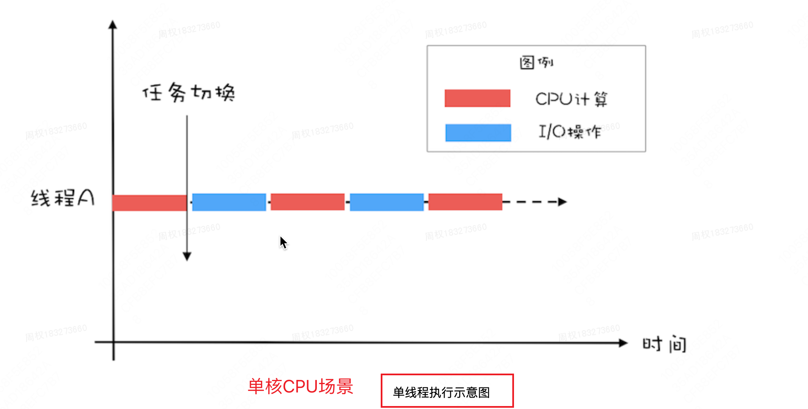
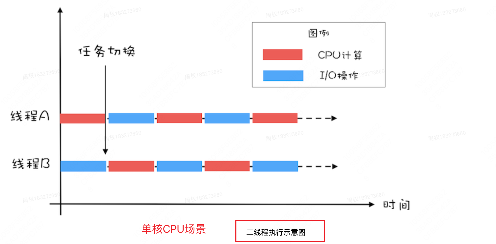
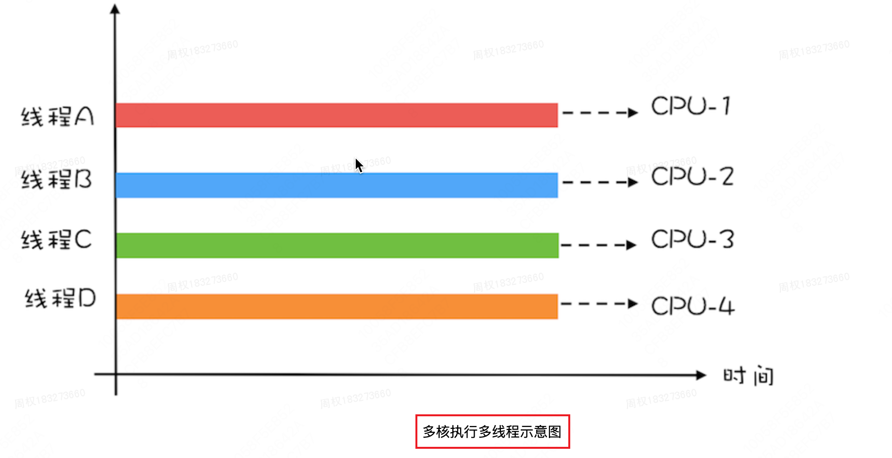
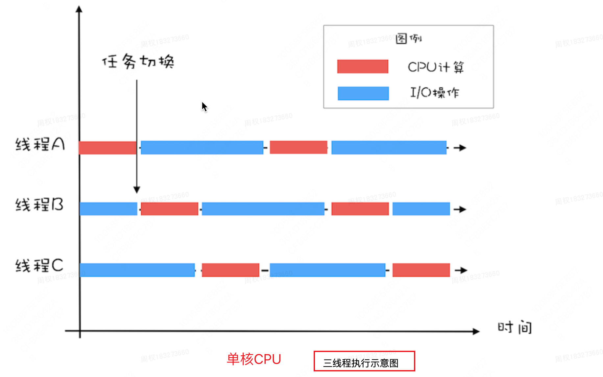

# 0、并发编程的意义

这要从计算机领域存在一条著名的定律——摩尔定律说起，摩尔定律由lntel的创始人之一戈登• 摩尔提出。其内容为：集成电路上可容纳的晶体管数目，约每隔两年便会增加一倍。这句话可以简单地理解为，计算机芯片的运算能力，约每隔两年就能提升一倍。

在二十世纪后半叶，计算机芯片的发展速度印证着这条规律。但是随着晶体管的尺寸越来越接近物理极限，所以自从2013年以来，芯片上集成的晶体管数目的增长速度开始放缓，各大厂商也被开始吐槽“挤牙膏”。

硬件的发展速度逐渐遭遇瓶颈，因此单个芯片上搭载多个CPU成为常态，并且运算能力越强的CPU意味着越昂贵。对于这一现状，各个软件公司的目标是使用更低的成本，开发出运行效率更高的软件。于是产生了“并行/并发编程”的思想，并行的主要目的在于，拆分需要处理的任务，将其发布到多个廉价的CPU上同时进行执行；并发的主要目的在于，由于CPU、寄存器、主存的速度差异，可以为多个任务交替分配CPU时间片，降低CPU闲置等待时间。通过这两种方式，整体上就能低成本地提升程序执行的效率。

但是，并非所有需要被处理任务都是完全独立的，当多个任务在执行期间想要进行读写同一块内存值时，问题出现了：我们应该如何管理共享内存？如何对多个任务进行同步管理，以至于程序不会出错？同时，我们依然需要秉持高效性能的目标，找到最优的解決方法。

这便是并发编程的意义，并发编程已经成为了一种主流的开发模式，这是一名工程师难以回避的进阶内容，也成为了各个公司面试考察的重点环节。

# 1、JVM线程模型

了解了并发编程的意义，那么在计算机上如何实现？ 这个话题很大，本文只介绍在Java开发领域，上层编码到下层运行之间的抽象方式，换言之，也就是JVM线程模型。

## 1.1 线程模型

**什么是线程模型？**

- Java字节码运行在JVM中，JVM运行在各个操作系统上。所以当JVM想要进行线程创建回收这种操作时，势必需要调用操作系统的相关接口，因为线程是属于操作系统的东西啊。也就是说，JVM线程与操作系统线程之间存在着某种映射关系，这两种不同维度的线程之问的规范和协议，就是线程模型。

**可能有读者会存在疑惑：为什么需要这样的中间层？**

- 我们在开发时，直接调用操作系统的接口来创建回收线程不是更直接吗？这个问题的答案显而易见，正如我们现在不常用汇编语言进行开发，而是使用更加简单容易上手的高级语言一样，**这是一种自下而上的抽象**。

- JVM线程对不同操作系统上的原生线程进行了高级抽象，使开发者大多数情况下可以不用关注下层细节，而只要专注上层开发。不过在学习过程中，我们秉持知其然并知其所以然的态度，就需要去理解这种抽象方式，这也有助于将来我们自己进行一些设计的时候，能够复用前人的思想。

理解了什么是线程模型，为什么要有线程模型。接下来介绍一下JVM线程模型的三种类型：一对一，多对一，多对多。

## 1.2 内核线程

**在具体介绍这三种类型之前，有必要先来介绍一下操作系统的内核线程本身是什么样的面貌**。

> 这里我们就以最主流的Linux内核为例。

有一道面试题非常普遍：“说说线程和进程的区别”。网上流传的答案之一是 “线程属于进程”，这个说法是不准确的。Linux线程又被称为 “轻量级进程”，这就使很多同学摸不着头脑，那到底是线程还是进程？我们可以这么去理解，**“线程”是抽象概念（KLT，内核线程）**，因为Linux内部没有专门为线程定义的数据结构和调度算法，所以**Linux去实现 “线程”的方式是 “轻量级进程”（LWP，轻量级进程），本质还是进程**。只不过加了一个“轻量级”的修饰词。

**“轻量级进程”与“进程”的区别在哪？**

- —个Linux进程拥有自己独立的地址空间，而一个轻量级进程没有自己独立的地址空间，只能共享同一个轻量级进程组下的地址空间。进程和轻量级进程的创建都使用clone系统调用，区别仅仅在于向clone函数传递的参数不同，来指定是否共享地址空间等资源。

明白了Linux内核线程的真面目，我们就来讲三种Java线程模型的区别。

## 1.3 一对一

JVM线程模型的三种类型：一对一，多对一，多对多。

**这种线程模型就是在Java线程（用户线程 UT ） 与操作系统线程 (KLT)之间建立一对一的关系**，这种关系看上去简单粗暴，但就是好用，可以看下面这张图，一目了然。

UT=用户线程；LWP=轻量级进程；KLT=内核线程

**优点：**

- 每个线程都是独立的调度单元，直接利用操作系统内核提供的调度功能。

**缺点：**

- **用户线程的阻塞唤醒，会直接映射到内核线程上，容易引起频繁切换，降低性能**。但是一些语言引入了CAS来避免一部分的内核调用，比如Java引入了AQS这种函数级别的锁，减少使用内核级别的锁，就能提升性能。

- Linux内核能够创建的资源毕竟是有限的，所以这在一定程度上会限制并发量。

==目前大部分主流JVM上都是采用的这种线程模型。==

## 1.4 多对一

可以看下面这张图，**图上多个用户线程映射到一个内核线进程上，**用户线程的调度需要由用户空间来完成。

优点：

- 提升并发量上限，大部分调度和同步操作都在用户空间内完成，减少状态切換，能够提升性能。

缺点：

- **当一个用户线程进行了内核调用并阻塞了，那么其他线程在这段时间里都无法进行内核调用。**

**Java早期版本就是采用的这种线程模型，不过后来被抛弃了。**

## 1.5 多对多

来看下面这张图。基本上能看得出来，这种方式的优点能够解决一对一和多对一模型的缺点，综合它们的优点。不过缺点就是，要实现这种线程模型难度比较高。

Go语言采用的GMP线程模型就是基于多对多的方式来实现的，这也是为什么能够利用goroutine实现更高并发的原因。值得一提的是，Java的Loom项目也在进行这方面的探索。

## 总结

到此为止，线程模型基本上就讲完了，介绍这篇内容是为了便于后续内容的理解。

我的体会是一对一的线程模型其实简单易用，便于控制，能够解决大部分场景下的问题，其实没有那么落后。而且在此基础上在上层进行编码时依旧存在一定复杂度，想要写出安全的代码也是一种挑战，不必好高骛远去摒弃它。而多对多模型虽然复杂，但将来应该能够更加成熟，应该是一种趋势，需要保持一种积极拥抱的态度去了解它。

# 2、悲观锁机制

这篇文章，我们首先来介绍一下Java这门语言的悲观锁(对象锁）机制。 主要循序渐进分为几个问题来一一击破。

## 2.1 什么是锁

> 在并发环境下，会出现多个线程对同一个资源进行争抢的情况，假设A线程对资源正在进行修改，此时B线程此时又对资源进行了修改，这就可能会导致数据不一致的问题。为了解決这个问题，很多编程语言引入了锁机制，通过一种抽象的“锁”来对资源进行锁定，当一个线程持有“锁”的时候，其他线程必须等待“锁”，**我认为这本质上就是在临界资源上对线程进行一种串行化。**
>
> 

**那么 Java语言中的锁机制是怎么设计的？在谈锁之前，我们需要简单了解一些Java虛拟机的内存结构**。关于内存结构不是本文的重点，暂时不会影响到你的理解。我们可以来看这张图：

JVM运行时内存结构主要包含了五个部分：程序计数器(PC寄存器）、JVM栈、Native方法栈、堆、方法区。

可以看到图中红色区域是各个线程私有的。这个区域中的数据，不会出现线程竞争的关系。而蓝色区域中的数据被所有线程共享，其中Java堆中存放的是大量对象，方法区中存放类信息、常量、静态变量等数据。当多个线程在竞争其中的一些数据时，可能会发生难以预料的异常情况。**在程序开发中，锁的主要应用范围就是在数据共享区域**。

==了解了“锁”这种抽象的概念，那么在代码层面，它究竟是如何实现的？==

- 在Java中，主要采用了两种实现方式：1. 基于Object的悲观锁。2.基于CAS的乐观锁。

==本文主要讲解基于Object的悲观锁：==

- **在Java中，每个Object，也就是每个对象都拥有一把锁，这把锁存放在对象头中，记录了当前对象被哪个线程占用。**

## 2.2 对象、对象头结构

刚才提到了锁是存储在对象头中的，那么对象和对象头的结构分别是什么呢？

**我们先来谈对象本身的结构，Java对象分为三个部分：**

- 对象头；实例数据；对齐填充字节；

TIPS：其中对齐填充字节是为了满足“Java对象大小是8字节的倍数”这一条件而设计的，为对象对齐填充了一些无用字节，大可不必理会。实例数据就是你在初始化对象时设定的属性和状态等内容。

**对象头是我们这期要讲的重点之一，它存放了一些对象本身的运行时信息。对象头包含了两部分：**

- **Mark Word**

- Class Pointer

相较于实例数据，对象头属于一些额外的存储开销，所以它被设计得极小（一般为32bit或64bit）来提升效率。Class Pointer是一个指针，指向当前对象类型所在方法区中的Class信息；

**Mark Word存储了很多当前对象的运行时状态信息，比如Hashcode、锁状态标志、指向锁记录的指针、偏向线程ID、锁标志位等等**。

>  上面也提到了，对象头被设计得很小，Mark Word则主要体现了这一点，通过这张表我们可以看到，Mark Word只有32bit（或64bit）并旦它是非结构化的。这样，在不同的锁标识位下，不同字段可以重用不同的比特位，节省了空间。

从这张表中能看到，这把抽象的“锁”的信息就存储在对象头的Mark word中。

**重点关注最后两位，这两位代表锁标志位，分别对应“无锁”、“偏向锁”、“轻量级锁”、“重量级锁”这四种状态**。

在Java中，启用对象锁的方式是使用synchronized关键字，那么synchronized背后的原理是什么，上面列举的这些状态又都是什么意思呢？

## 2.3 Synchronized

我们都知道，Java里面Synchronized关键字可以用来同步线程，它的底层原理是synchronized被编译后会生成monitorenter和monitorexit两个字节码指令，依赖这两个字节码指令来进行线程同步。

这里要介绍一样新事物：Monitor常常被翻译成监视器或管程。关于Monitor，简单来说，你可以把它想像成一个只能容纳一名客人房间，而把想要获取对象锁的线程想像成想要进入这个房间的客人。一个线程进入了Monitor，那么其他线程只能等待，只有当这个线程退出，其他线程才有机会进入。

==synchronized性能问题在于：==

**因为monitor的下层是依赖于操作系统的Mutex Lock来实现的**。Java线程事实上是对操作系统线程的映射（上篇讲到），所以每当挂起或唤醒一个线程都要切换到操作系统的内核态，这个操作是比较重量级的。在某些些情况下，甚至切换时间本身就会超出线程执行任务的时间，这样的话，使用synchronized将会对程序的性能产生影响。

但是从Java6开始，synchronized进行了优化，引入了 “偏向锁”、“轻量级锁”的概念。因此对象锁总共有四种状态，从低到高分别是“无锁”、“偏向锁”、“轻量级锁”、“重量级锁”，这就分别对应了Mark Word中锁标记位的四种状态。

## 2.4 对象锁的四种状态

目前为止，我们已经搞懂了什么是锁，什么是对象头，Mark Word中的字段，Synchronizedmonitor的初步原理，四种锁状态的由来。

接下来，你一定会对synchronized是如何优化的？这四种状态是如何变化的产生好奇，那么我们就来仔细看看“无锁”、“偏向锁”、“轻量级锁”、“重量级锁” 这四种状态各是什么。

**1、无锁状态**

无锁顾名思义就是没有对资源进行操作系统级别 (Mutex Lock） 的锁定。在这个基础上，我理解“无锁”其实有两种语义。

- 第一种比较简单，某种资源不会出现在多线程环境下，或者说即使出现在多线程环境下也不会出现线程竞争的情况，那么确实无需对这个资源进行任何同步保护，直接让他给各个线程随意调用就可以了。

- 另一种情況，资源会被竞争，但是不使用操作系统同步原语对共享资源进行锁定，而是通过一些其他机制来控制同步。比如CAS，通过诸如这种函数级别的锁，我们可以进行 “无锁”编程。

顺便一提的是，上面也分析了依赖操作系统Mutex Lock导致性能低下的原因，所以在大部分情况下，无锁的效率更高，但这并非意味着无锁能够全面代替有锁。

==**2、偏向锁**==

现在我们开始给对象进行加锁了；

那么偏向锁是怎么实现的呢？其实很简单，在Mark Word中，当锁标志位是01，那么判断倒数第三个bit是否为1，如果是1，代表当前对象的锁状态为偏向锁，于是再去读Mark Word的前23个bit， 这23个bit就是线程ID，通过线程1D来确认想要获得对象锁的线程是不是“被偏爱的线程”。

**但如果情况发生了变化，现有又有一个线程过来抢这个资源了，那么偏向锁就会自动升级为轻量级锁。**

==3、轻量级锁（两个线程争抢）==

**现在是通过对象头中的指针和线程虚拟机栈中的“Lock Record” 的空间进行锁定的**

当一个线程想要获得某个对象的锁时，假如看到锁标志位为00，那么就知道它是轻量级锁，这时，线程会在自己的虚拟机栈中开辟一块被称为“Lock Record” 的空间，头于虛拟机栈，上面简单讲过，是线程私有的。

> Lock Record中存放什么呢？存放的是对象头的Mark Word的副本以及Owner指针。线程通过CAS去尝试获取锁，一旦获得，那么将会复制该对象的Mark Word到虚拟机栈的Lock Record中，并且将Lock Record中的Owner指针指向该对象锁。另一方面，对象的Mark Word中的前30bit将生成一个指针，指向持有该对象锁的线程虛拟机栈中的Lock Record。 这样一来就实现了线程和对象锁的绑定，它们因此互相知道对方的存在。

此时对象已经被锁定了，那么其他线程要获取锁的会怎么办呢？此时其他线程会自旋等待。

==**4、重量级锁（3个以上线程争抢）**==

假如对象锁被一个线程持有着，此时也有一个线程正在自旋等待，如果同时又有多个线程想要获取这个对象锁。也就是说，一旦自选等待的线程数超过1个，那么轻量级锁将会升级为“重量级锁”。

**此时就会变成2.3节的机制，需要使用操作系统的Monitor管程进行监控**

## 2.5 总结

到此为止，我们知道了什么是锁，Java的悲观锁机制，Java的对象头构成，主要了解了其中Markword的各个字段以及作用。明白了Java悲观锁主要通过synchronized关键词来同步线程，悲观锁的四种状态以及其变化条件。我认为设计者之所以要定义这四种状态，目的就是尽量在用户空间内去完成锁的获取与释放，因为一旦进入“重量级锁” 状态，那么将会调用内核空间，产生较大开销。

# 3、乐观锁机制

前面我们说到了锁的四种状态里面的——“无锁”，他可以很大程度提高程序的并发性能，但其编程难度会很高。

一般我们针对共享资源，就是直接加锁，但加锁属于是悲观锁，悲观锁一方面在只有读的情况下，是不需要加锁的，其次主要的是会引发用户态和内核态的频繁切换，有一些情况下，可能代码块的执行耗时甚至低于线程切换的耗时，这就很影响节奏。

**那么有没有办法在不锁定资源的情况进行，也可以对线程的调用进行协调呢？这就是大名鼎鼎的CAS。**

## 3.1 CAS机制

CAS：全称compare and swap，即比较并交换，它是一条==CPU同步原语，是一种硬件对并发的支持，不会被中断==。可以解决多线程并行情况下，频繁加锁影响性能。

- CAS是一种**无锁的非阻塞算法**的实现。
- CAS包含了3个操作数:
  - 需要读写的内存值 V
  - 旧的预期值 A
  - 要修改的更新值 B
- 当且仅当 V 的值等于 A 时，CAS通**过原子方式用新值B来更新V的值**，否则不会执行任何操作（他的功能是判断内存某个位置的值是否为旧的预期值，如果是则更改为新的值，这个过程是原子的

**CAS有什么缺陷?**

> 万丈高楼平地起，在计算机世界中更是如此，底层开放一点新特性，上层就获得了施展手脚的舞台。有了CPU指令级对CAS的支持，以此为基础，就能促进上层产生多种多样无锁编程的思路，以及诞生各种各样好用的库和工具。

**这些通过CAS来实现同步的工具，由于不会锁定资源，**而且当线程需要修改共享资源对象时，总是会乐观地认为对象状态值没有被其他线程修改过，自己主动尝试去Compare And Set状态值，相较于上文提到的 “悲观锁”，这种同步机制被称作 “乐观锁”。

## 3.2 Java中的乐观锁编程

那么在Java中，是如何利用CAS特性来进行乐观锁编程的。

我们了解了CAS，知道了它是由底层指令架构支持的，那么上层如何封装调用，我们如何将CAS应用到我们的代码中？很多同学对它的认知可能还是模糊的，下面我们就以一个简单的实际的例子，来加深对CAS及其应用的理解。

> 假设有一个简单的需求，你需要使用3条线程，将一个值，从O累加到1000，你该怎么做？首先我写一种错误的写法，不使用任何同步操作，那么一定会出现线程安全问题。
>
> 
>
> 下面我们不使用Synchronized来同步线程，使用基于CAS的工具；如何使用乐观锁实现呢？非常简单。写过Java的同学应该都知道AtomicInteger这个类，它的底层通过CAS来实现了同步的计数器。我们可以将代码改成这样：
>
> 
>
> 当然，写这段代码，实现这个功能不是我们的目的。

**我们需要关注的是Atomiclnteger底层是如何通过CAS来做到无锁同步的。**

## 3.3 Atomiclnteger源码

**我们进入源码看一下**

AtomicInteger这个类的内容不多，主要的成员变量就是一个Unsafe类型的实例和一个Long类型的offset，这边注释也开门见山，告诉我们使用Unsafe的CAS操作来对值进行更新。

往下面我们可以看到**直接调用了Unsafe对象的getAndAddlnt方法**，进一步点进去，可以看到确实就是调用了Unsafe的compareAndSwaplnt方法 (CAS)。这里出现了一个循环，实际上这就是我之前提及的“自旋”。

有的同学会问，假如这边CAS操作一直失败，那么会不会一直死循环下去？问得好，自旋的次数实际上可以通过启动参数来配置，如果你不配置的话，默认是10，所以不会出现死循环。

## 3.4 unsafe类

点击进入unsafe类，我们可以看到很多方法都是native修饰符，说明这是一个本地方法，他和具体的平台实现相关；

如果你的CPU是x86架构，那么事实上这个本地方法将会调用系统的cmpxchg指令。我们可以在openjdk源码中的hotspot/src/share/vm/prims/unsafe.cpp和hotspot/src/share/vm/runtime/ Atomic.cpp 路径下找到，这些本地方法是c++写的。

## 3.5 总结

到此为止，我们介绍了乐观锁的概念、场景，以及CAS的实现方式。最后从CPU指令到应用层，我们看到了一个基于CAS的完整Demo。相信你对乐观锁，对CAS有了比较深入的理解。但是，本文由于篇幅，只举了一个很简单的Atomicinteger的例子，**更加高级的应用，将要结合AQS已经JUC中一系列经典工具，关于这些，也是我们下期的重点。**

# 4、重中之重AQS

上一期，我们介绍了乐观锁，而乐观锁的本质即是CAS，操作系统提供了支持CAS修改内存值的原子指令，所以乐观锁得以实现。

虽然底层已经通过CAS实现了乐观锁，Java的底层已经在Unsafe这个类中封装了compareAnd Swap方法，支持了对CAS原语的调用，**但是CAS只是能够原始的去修改内存上的一个值，那我们如何利用CAS去同步像对象这种的共享资源呢？这需要经过进一步的抽象和封装。**抽象这个词虽然简单，但私以为要做出高内聚低轉合的抽象绝对是难点。

在Java中最著名的并发包就是JUC，其中的组件和日常Java开发息息相关。==在JUC中，我认为最核心的组件便是AQS，可以这么理解，AQS是对CAS的一种封装和丰富，AQS引入了独占锁、共享锁等性质。==基于AQS，JUC中提供了更多适用于各种预设场景的组件，当然你也可以基于AQS开发符合自身业务场景的组件。所以，AQS作为承下启上的重点，我们需要仔细来看。

## 4.1 如何设计一个同步管理框架呢？

目前Java底层提供了CAS原语调用，那么如果让你来设计一个中间同步框架，对被竞争的资源进行同步管理，你会怎么做？

> 这里你可以停下来想一想自己的方案。当然，我们目前的能力很难做到完全可用，但至少可以思考一下设计思路，再来看看大师是怎么做的。

如果是我，我会从这几点这去思考：

- 第一点：既然我要做一个框架，首先它需要具有通用性，因为上层业务逻辑是千变万化的，所以这个框架在实现底层必要的同步机制的同时，要保证对外接口的简单性和纯粹性，开放一定的空间给上层业务编写。

- 第二点；既然CAS能够原子地对一个值进行写操作，那么我可以将这个值（称为status）作为竞争资源的标记位。在多个线程想要去修改共享资源时，先来读status，如果status显示目前共享资源空闲可以被获取，那么就赋子该线程写status的权限，当该线程原子地修改status成功后，代表当前线程占用了共享资源，并将status置为不可用，拒绝其他线程修改status，也就是拒绝其他线程获取共享资源。

- 第三点：其他线程的拒绝如何设计呢？这里应该有两种业务场景，有的业务线程它可能只想快速去尝试一下获取共享资源，如果获取不到也没关系，它会进行其他处理；有的业务线程它可能一定要获取共享资源才能进行下一步处理，如果当前时刻没有获取到，它愿意等待。

  针对第一种场景，直接返回共享资源的当前状态就可以了，**那么有的同学可能也会说，第二种场景也能直接返回，让业务线程自旋获取，直到成功为止**。这样说有一定的道理，但是我认为存在两个弊端：

  - 第一，让业务线程去做无保护的自旋操作会不断占用CPU时间片，长时间自旋可能导致CPU使用率暴涨，在CPU密集型业务场景下会降低系统的性能甚至导致不可用。但如果让上层业务去做保护机制，无疑增加了业务开发的复杂度，也增强了耦合度。
  - 第二，实现框架的目的是为了简化上层的操作，封装内部复杂度，第一点中我们也说到了需要保持对外接口的简单纯粹，如果还需要上层进行额外的处理，这并不是一个好的设计。

  所以，当业务线程一定要获取资源时，我们可以使用一个队列让这些线程进行等待。队列的头部不断自旋的尝试获取资源，其他线程全部挂起即可。这样就避免了大量线程的自旋操作，当头部线程成功占用了共享资源时，它再去唤醒后一个被挂起的线程即可。

**我的大致思路讲完了，事实上我说的内容和JUC中的经典同步框架AQS设计思路差不多。**

**AQS全称AbstractQueuedSynchronizer。顾名思义就是一个抽象的 (可被继承复用），内部存在排队（竞争资源的线程排队）的同步器（对共享资源和线程进行同步管理）**

## 4.2 深入AQS源码

**1、我们先来看一下AQS的成员属性**

很简单，一共就三个属性。state就是之前讲的用于判断共享资源是否被占用的标记位，volatile保证了线程之间的可见性。int类型的原因在于state需要表示线程占用数量，因此是int值。然后就是两个Node属性，这是双向链表的虚拟头节点和虚拟尾节点。

> 疑惑：为什么不使用boolean来表示呢，而是要使用int呢???
>
> 这里就要谈到线程获取锁的两种模式，独占和共享。简单介绍一下，当一个线程以独占模式获取锁时，其他任何线程都必须等待；而当一个线程以共享模式获取锁时，其他也想以共享模式获取锁的线程也能够一起访问共享资源，但其他想以独占模式获取锁的线程需要等待。这就说明了，共享模式下，可能有多个线程正在共享资源，所以state需要表示线程占用数量，因此是int值。

我们看一下节点类的成员属性：也很简单

其中，这个等待状态需要记一下：

- **0：表示节点已经释放锁；**

- **Cancelled：1：表示当前节点获取锁的请求不在了，不需要获取了；**

- **SIGNAL：-1 ：表示当前节点释放锁的时候，需要唤醒下一个节点**。

  所有，每个节点在休眠前，都需要将前置节点的 ws 设置成 SIGNAL。否则自己永远无法被唤醒。

- CONDITION 为-2，表示当前节点正在等待某一个Condition对象，和条件模式相关，本期暂不介

- PROPAGATE 为-3，传递共享模式下锁释放状态，和共享模式相关，本期暂不介绍

  

## 4.3 具体实现方法

我们之前提到了两种场景，下面我们思考如何通过标志位和这个队列完成同步等待的过程。所以盲猜AQS里面就有这两个场景的实现方法，果然如下。

### 1. tryAcquire()

==我们先来看一下tryAcquire（）方法==

tryAcquire是一个被 protected 修饰的方法，参数是一个int值，代表对int state的增加操作，返回值是boolean，代表是否成功获得锁。该方法只有一行实现 `throw new UnsupportedoperationException()`，意图很明显，AQS规定继承类必须override tryAcquire方法，否则就直接抛出`UnsupportedoperationException`。

**那么为什么这里一定需要上层自己实现？因为尝试获取锁这个操作中可能包含某些业务自定义的逻辑，比如是否“可重入”等，给了上层业务开放空间。**

- 如果上层调用tryAcquire返回true，线程获得锁，此时可以对相应的共享资源进行操作，使用完了进行释放。

- 如果调用tryAcquire返回false，且上层逻辑上不想等待锁，那么可以自己进行相应的处理；

- 如果上层逻辑选择等待锁，那么可以直接调用acquire方法，不用自己写复杂的排队处理逻辑。

**这里就体现了这个框架的灵活度**！！！

### 2. Acquire()

==接下来我们来看更加核心和复杂的 acquire（）方法。==

acquire被final修饰，表示不允许子类擅自override， 似乎是在宣示：等待并获取锁，我非常可靠，直接用就行，其他您就甭操心了。

判断条件包含了两部分：

- `!tryAcquire(arg)`   和 `acquireQueued( addWaiter(Node.EXCLUSIVE), arg )`

tryAcquire我们已经讲过了，这里的意思是，如果tryAcquire获取锁成功，那么ltryAcquire为false，说明己经获取锁，根本不用参与排队，也就是不用再执行后续判断条件。假如tryAcquire返回false，说明需要排队，那么就进而执行`acquirequeued(addWaiter(Node.EXCLUSIVE)，arg）`，其中呢acquireQueued 方法其中嵌套了`addwaiter `方法。

#### 1. addWaiter()

==前面说我们像剥洋葱一样来读源码，那么先来品一品`addWaiter( )`。==

顾名思义，这个方法的作用就是**将当前线程封装成一个Node，然后加入等待队列，返回值即为该Node。**

逻辑也非常简单，首先新建一个Node对象，之前也说过这个队列是先入先出的，接下来顺理成章地想到，我们需要将其插入队尾。但是下面我们需要考虑多线程场景，即假设存在多个线程正在同时调用addWaiter方法。

==新建pred节点引用，指向当前的尾节点，如果尾节点不为空，那么下面将进行三步操作：==

1．将当前节点的pre指针指向pred节点（尾节点）

2．尝试通过CAS操作将当前节点置为尾节点

​		a．如果返回false，说明pred节点已经不是尾节点，在上面的执行过程中，尾节点已经被其他线程修改，那么退出判断，**调用enq方法，进行完整的入队方法，重新进入队列。**

​		b.如果返回true，说明CAS操作之前，pred节点依然是尾节点，CAS操作使当前node顺利成为尾节点。若当前node顺利成为尾节点，那么pred节点和当前node之问的相对位置已经确定，此时将pred节点的next指针指向当前node，是不会存在线程安全问题的。

> 由于在多线程环境下执行，这里存在三个初学者容易迷糊的细节，也是该方法中的重点。
>
> 1. 某线程执行到第13行时，pred引l用指向的对象可能已经不再是尾节点，所以CAS失败；
>
> 2. 如果CAS成功，诚然CAS操作是具有原子性的，但是14，15两行在执行时并不具备原子性，只不过此时pred节点和当前节点的相对位置已经确定，其他线程只是正在插入新的尾节点，并不会影响到这里的操作，所以是线程安全的。
>
> 3. 需要记住的是，当前后两个节点建立连接的时候，首先是后节点的pre指向前节点，当后节点成功成为尾节点后，前节点的next才会指向后节点。

==我们再来看第18行的完整入队列逻辑, 程序运行到这一行，说明出现了两种情况之一：==

- 队列为空

- 快速插入失败，想要进行完整流程的插入，这里所说的快速插入，指的就是11-17行的逻辑，当并发线程较少的情况下，快速插入成功率很高，程序不用进入完整流程插入，效率会更高。既然程序来到了第18行，那么我们就来看看完整流程的插入是什么样子的。

这个方法里的逻辑，有一种似曾相识的感觉，其实就是在最外层加上了一层死循环，如果队列未初始化 (tail ==null)，那么就尝试初始化，如果尾插节点失败，那么就不断重试，直到插入成功为止。

> **那为什么不直接调用完整的入队方法呢？它就是多了一个判空操作而言**
>
> 这里猜想是因为，作者发现频繁的判空操作会影响性能，因为队列为空只用判断一次就行了，后面都不需要判断了，可见作者为了追求极致的性能，很细致。

#### 2. acquireQueued()

现在我们已经将节点放入队列了，但是不能就这么不管了，我们还需要让这个双向链表动起来，因为他是一个FIFO队列。

我最初的猜测是：既然存在一个FIFO队列，那么可能会使用了 “生产-消费”模式，有一个消费者不断从这个队列的头部获取节点，让他去不断拿锁。

但是实际上AQS并没有这么做，并我们想象的更加巧妙。

**它在各个线程中维护了当前Node的waitstatus，根据根据不同的状态，来实现队列的先入先出。通过调用 acquireQueued 方法，开始对Node的waitStatus进行跟踪维护。**

下面，我们看一下这个acquireQueued的方法源码部分，一点点进行解析，实现了双向链表的先入先出；

其中这个`cancelAcquire()`方法作用是：取消当前线程拿锁的行为，就在在这个期间线程出现了异常，但现在线程节点已经在队列里面了哦，具体方法内部就是改变了线程节点的status状态，不是重点。

**这里呢，有三点需要着重关注一下。**

​	1、一个约定：==head节点代表当前正在持有锁的节点，状态为0或者-3（这里比较复杂）。若当前节点的前置节点是head，那么该节点就开始自旋地获取锁==。一旦head节点释放，当前节点就能第一时问获取到。

​	2、shouldParkAfterFailedAcquire 和 parkAndCheck/nterrupt方法体细节。

​	3、**interrupted变量**最终被返回出去后，上层acquire方法判断该值，来选择是否调用当前线程中断。这里属于一种延迟中断机制。

> 这里简单讲解一下这个interrupted变量的含义，他和Java里面的线程中断机制有关。
>
> 

==我们接下来研究**“是否需要被挂起的方法shouldParkAfterFailedAcquire（）”**，如下：==

**若当前节点没有拿锁的权限或拿锁失败，那么将会进入should ParkAfterFailedAcquire 判断是否需要挂起 (park)**，

方法的参数是**pred Node**和**当前Node**的引用。

首先获取pred Node 的waitstatus， 我们再来回顾一下该枚举值的含义。

- 0，节点初始化默认值或节点已经释放锁
- CANCELLED为1，表示当前节点获取锁的请求已经被取消了
- SIGNAL 为-1，表示当前节点的后续节点需要被被唤醒
- CONDITION 为-2，表示当前节点正在等待某一个Condition对象，和条件模式相关，本期暂不介绍

**回到方法中，若pred的waitSatus为 SIGNAL，说明前置节点也在等待拿锁，并且之后将会唤醒当前节点，**所以当前线程可以挂起休息，返回true。==拥有锁的线程节点，它的状态是0或者是-3，反正不是SIGNAL。==

如果Ws大于0，说明pred的waitsatus是CANCEL，所以可以将其从队列中删除。这里通过从后向前搜索，将pred指向搜索过程中第一个waitSatus为非CANCEL的节点。相当于链式地删除被CANCEL的节点。**然后返回false，代表当前节点不需要挂起，因为pred指向了新的Node，需要重试外层的逻辑。**

如果`shouldParkAfterFailedAcquire`返回false，那么再进行一轮重试；

==如果返回true，代表当前节点需要被挂起，则执行`parkAndChecklnterrupt`方法。==

此时当前Node中的线程将阻塞在此处，直到持有锁的线程调用release方法，release方法会唤醒后续节点。

**那这边的 return Thread. interrupted(）又是什么意思呢？**这是因为在线程挂起期间，该线程可能会被调用中断方法，线程在park期问，无法响应中断，所以只有当线程被唤醒，执行到第3行，才会去检查park期间是否被调用过中断，如果有的话，则将该值传递出去，通过外层来响应中断。

==通过对`acquireQueued`这个方法的分析，我们可以这么说，==如果当前线程所在的节点处于头节点的后一个，那么它将会不断去尝试拿锁，直到获取成功。否则进行判断，是否需要挂起。这样就能保证head之后的一个节点在自旋CAS获取锁，其他线程都已经被挂起或正在被挂起。这样就能最大限度地避免无用的自旋消耗CPU。

### 3. Release()

但事情还没有结束，既然大量线程被挂起，那么就会有被唤醒的时机。上面也提到，当持有锁的线程释放了锁，那么将会尝试唤醒后续节点。我们一起来看release方法。

和tryAcquire一样，tryRelease也是AQS开放给上层自由实现的抽象方法。

在release中，假如尝试释放锁成功，下一步就要唤醒等待队列里的其他节点，这里主要来看unparkSuccessor这个方法。**参数是head Node.**

获取head的waitStatus，如果不为0，那么将其置为0，表示锁已释放。

接下来获取后续节点如果后续节点为null或者处于CANCELED状态，那么从后往前搜索，找到除了head外最靠前且非CANCELED状态的Node，对其进行唤醒，让它起来尝试拿锁。**之前的head后面那个一直自选拿锁的，现在就已经拿到锁了，并且他是头节点head了。**

==这时，拿锁、挂起、释放、唤醒都能够有条不紊，且高效地进行。==

## 4.4 总结

好了，到此为止，AQS中关于独占锁的内容进行了详尽的讲解，并且针对其中的一些细节也聊了聊自己的疑惑和思考。如果你完全理解了，那么恭喜你；如果你还存在一些疑惑，不妨自己打开源码，通过单步调试，加深自己的理解。

# 5、JUC工具包

# 6、JUC.ReentrantLock

ReeentrantLock作为开发中最常用的组件，也作为面试中被问到的最高频的锁之一，我们有必要来聊聊它的作用以及内部构造。

**ReentrantLock基于AQS，它实现了公平锁和非公平锁，在开发中可以用它对共享资源进行同步。**

**此外，和synchronized一样，ReentrantLock支持可重入，但ReentrantLock在调度上更灵活，支持更多丰富的功能。**

接下来，我们阅读一下ReentrantLock的源码，仔细研究一下他是如何基于AQS实现对资源的同步的。

可以看到，同样十分简单，

- 实现了**Lock**锁接口，那么里面的抽象方法肯定是我们研究的重点；
- 一个成员属性：**sync**
- 三个内部类：**Sync**（抽象类）、 **NonfairSync**、 **FairSync**

## 6.1 Lock接口

最开头的一段注释介绍了Lock的意义在于提供了**区别于synchronized的另一种具有更多广泛操作的同步方式**，它能支持更多灵活的结构，并且可以关联多个Condition对象。Condition是Java提供的一个用于线程通信的接口，下文将会介绍。

Lock.java源码文件显然有350多行，但只对六个方法进行了定义，其余都是注释。注释篇幅比较长，我这里就来简单概括一下，感兴趣的同学可以自己去通读一下注释。

- `void lock() `，顾名思义就是用于获取锁，假如当前锁被其他线程占用，那么将会等待直到获取为止。
- `void lockInterruptibly()`和`lock()`类似，也是用于获取锁，但区别在于，假如当前线程在等待锁的过程中被中断，那么将会退出等待，并抛出中断异常。
- `boolean tryLock()`，尝试获取锁，无论是否获取都立即返回，返回值代表是否获取锁。
- `boolean tryLock(long time, TimeUnit unit）`，尝试获取锁并设定等待超时时间，返回值代表是否获取锁。
- `void unlock()`，顾名思义释放锁。
- `condition newcondition（）`，新建一个绑定在当前Lock对象上的Condition对象。

> TIPS: Condition对象是什么？简单来说，它表示一个条件，不同线程可以通过该条件来进行通信。比如某线程可以通过 await 方法注册在condition对象上进行等待，然后通过condition对象的signal方法将该线程唤醒。这有点类似Object锁的wait和notity方法。但不同的是，一个Lock对象可以关联多个Condition对象，多个线程可以被鄉定在不同的Condition对象上，这样就可以分组等待唤醒。此外，Condition对象还提供了和限时、中断相关的功能，丰富了线程的调度策略。

至此为止，Lock接口差不多介绍完了。可以说它只是定义了一些方法的语义，规定了它的实现类需要满足这些语义。

接下来我们就要看看ReentrantLock是如何按照这些抽象约定来进行实现的。

## 6.2 唯一属性sync

ReentrantLock只有一个属性：即Sync类型的变量sync，且被final修饰，意味着一旦初始化，就不可修改引用了。

那么它的初始化时机是什么时候？

答案肯定是构造器里面，

默认无参构造器中，sync将被初始化为非公平锁对象，而在含参构造器中，可以通过参数指定其被初始化为公平锁还是非公平锁对象。这里的`NonfairSync`和`FairSync`两个类，看名字能够知道其分别为实现了非公平性和公平性的锁，下文将会详细讲解。

## 6.3 抽象内部类Sync

我们接下来看一下这个第一个final方法；

>  这里就有点奇怪，刚才不是说公平性获取锁和非公平性获取锁的逻辑都应该分别在FairSync和NonFairSync中单独实现，那么在Sync这个基类中，为什么会出现 nonfairTryAcquire 这种方法？我猜测应该是FairSync和NonFairSync中都需要用到该方法，那为什么FairSync中会用到nonfairTryAcquire 这种非公平性的方法？我们暂时存疑，下文再看。

然后第二个final方法：

关于Sync，内容不多，它是一个抽象类，它的两个子类NonfairSync、 FairSync分别实现了公平性锁和非公平性锁。

==那么，什么是公平性锁和非公平性锁？==

为什么非公平锁的性能会更高？现实生活中不是排队比争抢效率更高吗？

**这是因为非公平锁意味着后请求锁的线程可能在前面的休眠线程恢复前拿到锁，这样就有可能提高并发的性能。** 也就是说，有可能前面线程苏醒需要的时间更长，这样可以让苏醒时间最短的线程最线拿到锁，对于锁而言，空闲的状态最短暂。这是非公平锁某些时候比公平锁性能要好的原因之一。

## 6.4 NonfairSync和FairSync

从上面可以看出，

- 使用lock方法时，会先进行一次CAS的尝试，当尝试获取锁失败时，调用acquire方法，但是记得哦在acquire内部，首先会调用一次tryAcquire方法，它已经被这个Sync类重写了（nonfairTryAcquire），它又会先直接尝试获取锁，如果没有获取到，最后就乖乖进入队列等待了。**这就体现了“非公平性”。即先来两次直接获取锁，再排队。**
- 使用tryAcquire方法时，会直接调用nonfairTryAcquire方法，这个里面会进行一次直接获取锁。
- **最后，两个方法都调用了Sync写的nonfairTryAcquire方法，它里面实现了可重入性。**

## 6.5 对Lock内方法的实现

讲完了三个内部类的源码，最后就是ReentrantLock实现Lock接口，它是如何重写最前面讲的Lock接口内的方法呢？

**可以大胆猜测，既然NonfairSynC、 FairSync已经做了比较完整的封装，那么ReentrantLock的实现方法无非就是对这两个类的调用。**

再次提一句：ReentrantLock内的Sync类的属性，在构造函数里面进行初始化，一个是NonfairSync，一个是公平锁。

### **lock() 方法**

果然，我们点开可以看到ReentrantLock对Lock锁里面的`lock`方法实现就是简单一行.

### **lockInterruptibly()方法**

locklnterruptibly与lock方法的区别在于，当线程在等待锁的期间，是否立即相应中断。

- lock方法中，线程被调用interrupt后不会立即响应中断信息，会在该线程等待获取锁之后，再响应中断，这点在讲解AQS那期中，讲到了中断信号延迟传递的机制。

- locklnterruptibly方法中，若线程在等待获取锁期间被调用了中断，那么将会立即抛出中断异常。

> TIPS：下面简单介绍一下Java的线程中断机制。
>
> 1．线程在RUNNABLE状态下
>
> 假如现在有一条线程，它的状态是RUNNABLE。若此时你调用它的interrupt中断方法，它将继续运行，并不会抛出中断异常，而是只修改Thread对象中一个标志中断状态的boolean值，true代表被调用中断，false代表未被调用中断。
>
> 那么这就有个问题，开发者怎么知道该线程究竟有没有被调用中断？ 这里JDK提供了两个API,名为islnterrupted， 返回这个Thread对象内的中断状态值；另一个名为interrupted，返回这个Thread对象内的中断状态值并且将其置为falseo
>
> 若你需要关注某线程在RUNNABLE状态下的中断状态，那么可以轮询islnterrupted方法。
>
> 2. 线程在BLOCKED/WAITING状态下
>
> 假如现在有一条线程，它的状态是BLOCKED或者WAITING，若此时你调用它的interrupt中断方法，如果该线程是通过调用sleep，wait等方法进入BLOCKED或WAITING状态的，那么该线程将修改中断状态值并直接抛出中断昇常。
>
> 另一方面，如果该线程是通过LockSupport.park方法进入BLOCKED状态的，那么不会抛出中断异常，而是将状态值置为trueo

### tryLock()方法

尝试获取锁，直接调用Sync的nonfairTryAcquire方法；

这就是说明：ReentrantLock的`tryLock()`永远都是非公平的，因为nonfairTryAcquire会进行一次直接cas操作拿锁。为什么要这样设计呢？因为我们tryLock是只进行一次获取锁，然后直接返回的，所以肯定是非公平的。

### 其他方法

## 6.6 总结

到此为止，我们总结一下，

1、首先介绍了Lock接口，确认了它的抽象概念以及方法的含义。

2、然后主要介绍了Reentrantlock中三个主要的内部类Sync、 NonfairSync和FairSync，其中Sync是后两者的抽象父类。

3、在介绍Sync时，讲解了它如何实现可重入特性，在介绍NonfairSync和FairSync时，讲解了公平锁与非公平锁的概念以及它们各自的实现方式。

4、最后，在介绍ReentrantLock对Lock的实现时，介绍了Java的中断机制。并且与上期的AQS内容结合，将知识连贯了起来。

# 7. 线程池创建多少线程合适？

在Java领域，实现并发程序的主要手段就是多线程，使用多线程还是比较简单的，但是使用多少个线程却是个困难的问题。工作中，经常有人问，“各种线程池的线程数量调整成多少是合适的？”或者“Tomcat的线程数、Jdbc连接池的连接数是多少？”等等。那我们应该如何设置合适的线程数呢？

要解决这个问题，首先要分析以下两个问题：

1. 为什么要使用多线程？
2. 多线程的应用场景有哪些？

## 7.1 为什么要使用多线程？

使用多线程，本质上就是提升程序性能。不过此刻谈到的性能，可能在你脑海里还是比较笼统的，基本上就是快、快、快，这种无法度量的感性认识很不科学，所以在提升性能之前，首要问题是：如何度量性能。

度量性能的指标有很多，但是有两个指标是最核心的，它们就是延迟和吞吐量。**延迟**指的是发出请求到收到响应这个过程的时间；延迟越短，意味着程序执行得越快，性能也就越好。 **吞吐量**指的是在单位时间内能处理请求的数量；吞吐量越大，意味着程序能处理的请求越多，性能也就越好。这两个指标内部有一定的联系（同等条件下，延迟越短，吞吐量越大），但是由于它们隶属不同的维度（一个是时间维度，一个是空间维度），并不能互相转换。

我们所谓提升性能，从度量的角度，主要是**降低延迟，提高吞吐量**。这也是我们使用多线程的主要目的。那我们该怎么降低延迟，提高吞吐量呢？这个就要从多线程的应用场景说起了。

## 7.2 多线程的应用场景

要想“降低延迟，提高吞吐量”，对应的方法呢，基本上有两个方向，一个方向是**优化算法**，另一个方向是**将硬件的性能发挥到极致**。前者属于算法范畴，后者则是和并发编程息息相关了。那计算机主要有哪些硬件呢？主要是两类：一个是I/O，一个是CPU。简言之，**在并发编程领域，提升性能本质上就是提升硬件的利用率，再具体点来说，就是提升I/O的利用率和CPU的利用率**。

估计这个时候你会有个疑问，操作系统不是已经解决了硬件的利用率问题了吗？的确是这样，例如操作系统已经解决了磁盘和网卡的利用率问题，利用中断机制还能避免CPU轮询I/O状态，也提升了CPU的利用率。但是操作系统解决硬件利用率问题的对象往往是单一的硬件设备，而我们的并发程序，往往需要CPU和I/O设备相互配合工作，也就是说，**我们需要解决CPU和I/O设备综合利用率的问题**。关于这个综合利用率的问题，操作系统虽然没有办法完美解决，但是却给我们提供了方案，那就是：多线程。

下面我们用一个简单的示例来说明：如何利用多线程来提升CPU和I/O设备的利用率？假设程序按照CPU计算和I/O操作交叉执行的方式运行，而且CPU计算和I/O操作的耗时是1:1。

如下图所示，如果只有一个线程，执行CPU计算的时候，I/O设备空闲；执行I/O操作的时候，CPU空闲，所以CPU的利用率和I/O设备的利用率都是50%。

如果有两个线程，如下图所示，当线程A执行CPU计算的时候，线程B执行I/O操作；当线程A执行I/O操作的时候，线程B执行CPU计算，这样CPU的利用率和I/O设备的利用率就都达到了100%。

我们将CPU的利用率和I/O设备的利用率都提升到了100%，会对性能产生了哪些影响呢？通过上面的图示，很容易看出：单位时间处理的请求数量翻了一番，也就是说吞吐量提高了1倍。此时可以逆向思维一下，**如果CPU和I/O设备的利用率都很低，那么可以尝试通过增加线程来提高吞吐量**。

- **在单核时代，**多线程主要就是用来平衡CPU和I/O设备的。如果程序只有CPU计算，而没有I/O操作的话，多线程不但不会提升性能，还会使性能变得更差，原因是增加了线程切换的成本。

- **但是在多核时代，**这种纯计算型的程序也可以利用多线程来提升性能。为什么呢？因为利用多核可以降低响应时间。

  > 为便于你理解，这里我举个简单的例子说明一下：计算1+2+… … +100亿的值，如果在4核的CPU上利用4个线程执行，线程A计算[1，25亿)，线程B计算[25亿，50亿)，线程C计算[50，75亿)，线程D计算[75亿，100亿]，之后汇总，那么理论上应该比一个线程计算[1，100亿]快将近4倍，响应时间能够降到25%。一个线程，对于4核的CPU，CPU的利用率只有25%，而4个线程，则能够将CPU的利用率提高到100%。
  >
  > 

## 7.3 创建多少线程合适？

创建多少线程合适，要看多线程具体的应用场景。

- 我们的程序一般都是CPU计算和I/O操作交叉执行的，由于I/O设备的速度相对于CPU来说都很慢，所以大部分情况下，I/O操作执行的时间相对于CPU计算来说都非常长，这种场景我们一般都称为I/O密集型计算；
- 和I/O密集型计算相对的就是CPU密集型计算了，CPU密集型计算大部分场景下都是纯CPU计算。I/O密集型程序和CPU密集型程序，计算最佳线程数的方法是不同的。

下面我们对这两个场景分别说明。

**1、对于CPU密集型计算**

- 对于CPU密集型计算，多线程本质上是提升多核CPU的利用率，所以对于一个4核的CPU，每个核一个线程，理论上创建4个线程就可以了，将任务拆分成4个部分让他们分别去跑，最后合在一起即可，再多创建线程也只是增加线程切换的成本。

- 所以，**对于CPU密集型的计算场景，理论上“线程的数量=CPU核数”就是最合适的**。不过在工程上，**线程的数量一般会设置为“CPU核数+1”**，这样的话，当线程因为偶尔的内存页失效或其他原因导致阻塞时，这个额外的线程可以顶上，从而保证CPU的利用率。

**2、对于IO密集型计算**

- 对于I/O密集型的计算场景，比如前面我们的例子中，如果CPU计算和I/O操作的耗时是1:1，那么2个线程是最合适的。如果CPU计算和I/O操作的耗时是1:2，那多少个线程合适呢？是3个线程，如下图所示：CPU在A、B、C三个线程之间切换，对于线程A，当CPU从B、C切换回来时，线程A正好执行完I/O操作。这样CPU和I/O设备的利用率都达到了100%。

  

- 通过上面这个例子，我们会发现，对于I/O密集型计算场景，最佳的线程数是与程序中CPU计算和I/O操作的耗时比相关的，我们可以总结出这样一个公式：

  > 最佳线程数=1 +（I/O耗时 / CPU耗时）

  我们令R=I/O耗时 / CPU耗时，综合上图，可以这样理解：当线程A执行IO操作时，另外R个线程正好执行完各自的CPU计算。这样CPU的利用率就达到了100%。

  不过上面这个公式是针对单核CPU的，至于多核CPU，也很简单，只需要等比扩大就可以了，计算公式如下：

  > 最佳线程数=CPU核数 * [ 1 +（I/O耗时 / CPU耗时）]

## 总结

很多人都知道线程数不是越多越好，但是设置多少是合适的，却又拿不定主意。其实只要把握住一条原则就可以了，这条原则就是**将硬件的性能发挥到极致**。上面我们针对CPU密集型和I/O密集型计算场景都给出了理论上的最佳公式，这些公式背后的目标其实就是**将硬件的性能发挥到极致**。

对于I/O密集型计算场景，==I/O耗时和CPU耗时的比值是一个关键参数，不幸的是这个参数是未知的==，而且是动态变化的，所以工程上，我们要估算这个参数，然后做各种不同场景下的压测来验证我们的估计。不过工程上，原则还是**将硬件的性能发挥到极致**，所以压测时，我们需要重点关注CPU、I/O设备的利用率和性能指标（响应时间、吞吐量）之间的关系。
